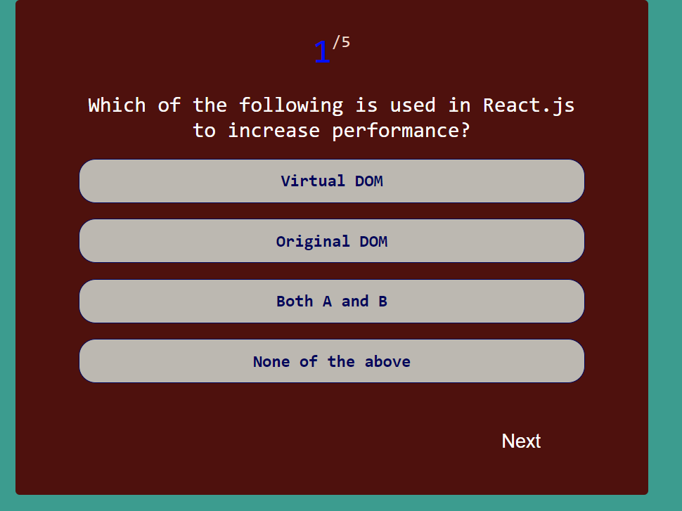

# Quiz Application
## Description
A simple React-based quiz application that allows users to answer multiple-choice questions, see their results at the end, retake the quiz, and download their answers as a CSV file. The results are visualized using pie and bar charts.

## Contents
- [Quiz Application](#quiz-application)
  - [Description](#description)
  - [Contents](#contents)
  - [Features](#features)
  - [Screenshot](#screenshot)
  - [Installation](#installation)
  - [Usage](#usage)
  - [Credits](#credits)

## Features
- Multiple-choice quiz with progress tracking.
- Correct and incorrect answer feedback.
- Final score display.
- Option to retake the quiz.
- Download quiz results as a CSV file.
- Results visualization with pie and bar charts.

## Screenshot
Here is the quiz screenshot:

And the results screenshot is here:


## Installation
1. Clone the repository:
    ```bash
    git clone https://github.com/yourusername/quiz-app.git
    cd quiz-app
    ```
2. Install dependencies:
    ```bash
    npm install
    ```
3. Start the application:
    ```bash
    npm start
    ```

## Usage
1. Open your browser and navigate to `http://localhost:3000`.
2. Answer the quiz questions by clicking on the choices.
3. Click "Next" to move to the next question.
4. After answering all questions, you will see your results visualized with charts.
5. Click "Retake Quiz" to start over or "Download Results as CSV" to save your answers.

## Credits
This project was developed using:
- [React](https://reactjs.org/) - A JavaScript library for building user interfaces.
- [Chart.js](https://www.chartjs.org/) - Simple yet flexible JavaScript charting library.
- [react-chartjs-2](https://github.com/reactchartjs/react-chartjs-2) - React wrapper for Chart.js.
- [create-react-app](https://github.com/facebook/create-react-app) - Set up a modern web app by running one command.

Developed by [Mike Thomas](https://github.com/Mikemupararano).


